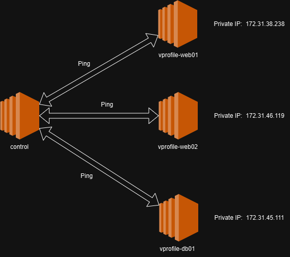
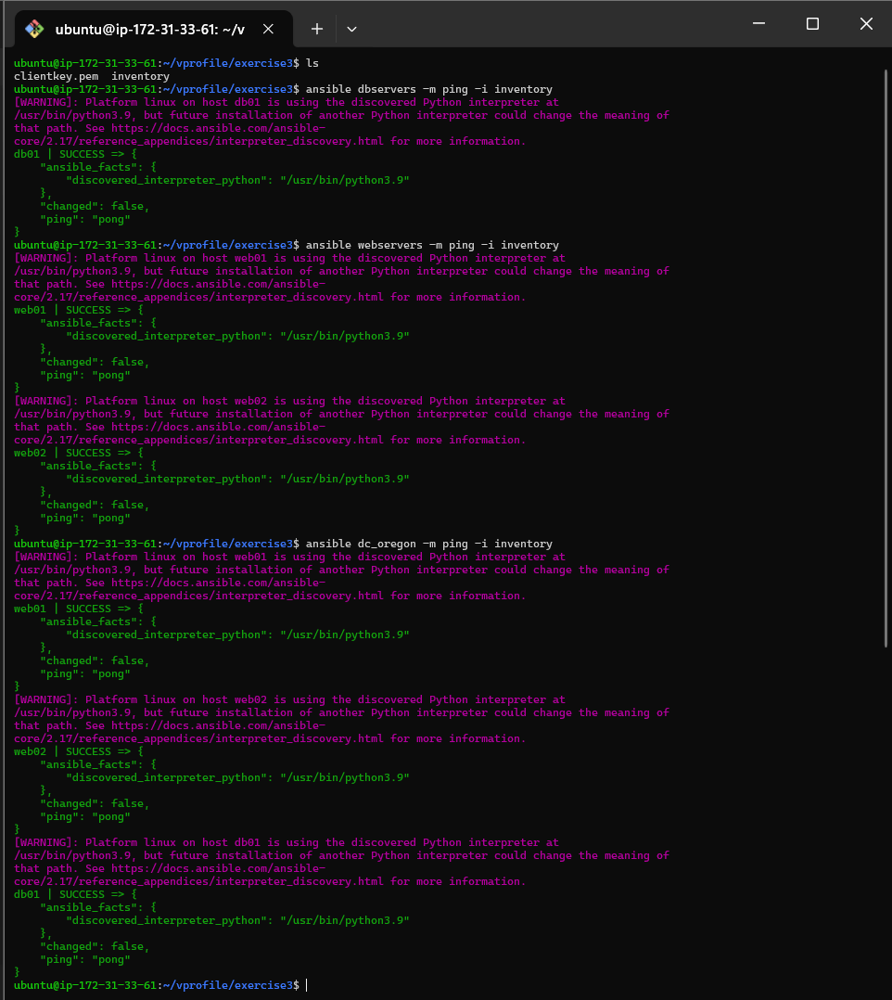

# AnsibleAutomations

Q. What is Ansible?
- Ansible is an open-source automation tool that simplifies the process of managing and configuring computers, servers, and network devices. It is widely used for tasks such as configuration management, application deployment, task automation, and orchestration across multiple systems.

--- 

### **Ansible Connections**:


---

### **Ansible Architecture:**


### **Installing Ansible in ubuntu:**

```
$ sudo apt update
$ sudo apt install software-properties-common
$ sudo add-apt-repository --yes --update ppa:ansible/ansible
$ sudo apt install ansible
```

### **Web appliaction Infrastructure in AWS**



Q. What is Inventory in Ansible?
- In Ansible, the inventory file is a key component that defines the hosts (i.e., servers or nodes) where the Ansible automation tasks are to be executed. It lists all the managed nodes and groups them for easier task management. The inventory file can include hostnames, IP addresses, or groups of hosts, and it's used to tell Ansible where to run the playbooks.

- Inventory file for two webservers and one database server
- ```
  all:
    hosts:
      web01:
        ansible_host: 172.31.38.238
        ansible_user: ec2-user
        ansible_ssh_private_key_file: clientkey.pem
      web02:
        ansible_host: 172.31.46.119
        ansible_user: ec2-user
        ansible_ssh_private_key_file: clientkey.pem
      db01:
        ansible_host: 172.31.45.111
        ansible_user: ec2-user
        ansible_ssh_private_key_file: clientkey.pem
  
    children:
      webservers:
        hosts:
          web01:
          web02:
      dbservers:
        hosts:
          db01:
      dc_oregon:
        children:
          webservers:
          dbservers:
  
  ```

- After using vars, inventory file looks like as shown below
- ```
  all:
  hosts:
    web01:
      ansible_host: 172.31.38.238
    web02:
      ansible_host: 172.31.46.119
    db01:
      ansible_host: 172.31.45.111

  children:
    webservers:
      hosts:
        web01:
        web02:
    dbservers:
      hosts:
        db01:
    dc_oregon:
      children:
        webservers:
        dbservers:
      vars:
        ansible_user: ec2-user
        ansible_ssh_private_key_file: clientkey.pem 
  ```
### **Ping from control to all the servers**
- The following are the ping commands in ansible
   ```
    ansible dbservers -m ping -i inventory
    ansible webservers -m ping -i inventory
    ansible dc_oregon -m ping -i inventory
    ansible all -m ping -i inventory
    ansible 'web*' -m ping -i inventory
   ```
- Responses of the above ping commands

