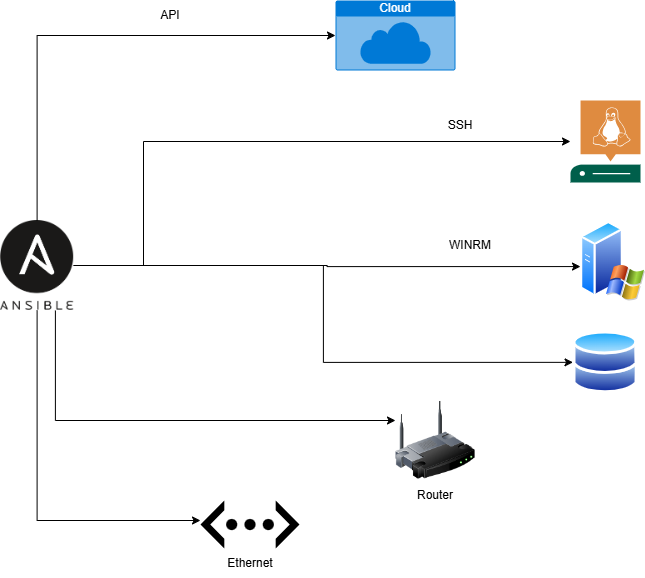
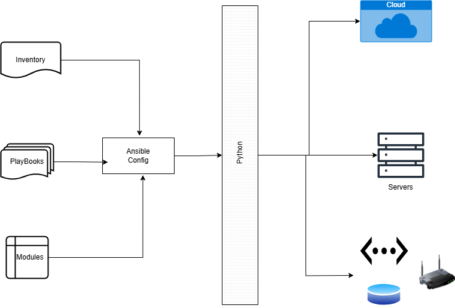

# AnsibleAutomations

Q. What is Ansible?
- Ansible is an open-source automation tool that simplifies the process of managing and configuring computers, servers, and network devices. It is widely used for tasks such as configuration management, application deployment, task automation, and orchestration across multiple systems.

--- 

### **Ansible Connections**:

---

### **Ansible Architecture:**

